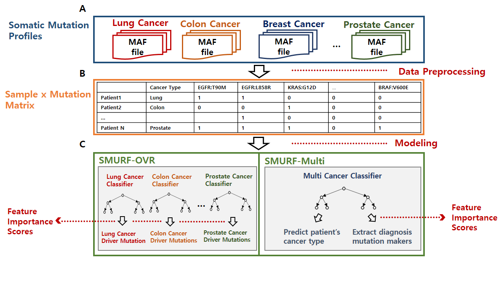

# SMURF
Codes for SMURF: Machine learning pipeline for discovering cancer type specific driver mutations and diagnostic markers.

## Pipeline

## Requirements
- python (recommend installing Anaconda2)
- numpy
- scipy
- sklearn
- pandas
- time
